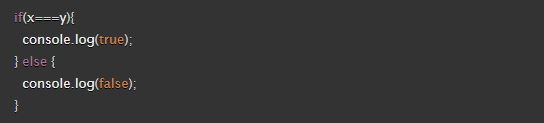

#### *Why This Topic Matters As it Relates to This Module*
I don't think I "get" the controlled component concept all that well yet, but the ternary operators seem to be something that will be called into practice on a regular basis. Also, it ties in neatly with re-factoring standard functions and clunky object literals into the more streamlined ES6 features of JavaScript.

### [React Docs - Forms](https://reactjs.org/docs/forms.html)
#### 1. What is a ‘Controlled Component’?
"In HTML, form elements such as < input>, < textarea>, and < select> typically maintain their own state and update it based on user input. In React, mutable state is typically kept in the state property of components, and only updated with setState().

We can combine the two by making the React state be the “single source of truth”. Then the React component that renders a form also controls what happens in that form on subsequent user input. An input form element whose value is controlled by React in this way is called a “controlled component”." -From[reactjs.org](https://reactjs.org/docs/forms.html)

#### 2. Should we wait to store the users responses from the form into state when they submit the form OR should we update the state with their responses as soon as they enter them? Why.
I didn't see the answer to this in the reading but I would think you'd want to update the state with responses as soon as they are entered due to the potential of users to get distracted ("Squirrel!!") and not get around to submitting the form. This would of course depend upon the application use-case.

#### 3. How do we target what the user is entering if we have an event handler on an input field?
I don't know, YET.

### [The Conditional (Ternary) Operator Explained](https://codeburst.io/javascript-the-conditional-ternary-operator-explained-cac7218beeff)
#### 1. Why would we use a ternary operator?
Ternary operators allow us to effect the same results as multi-line code blocks in a single line of code; we would use them for code efficiency.

#### 2. Rewrite the following statement using a ternary statement:

Original: if(x===y){console.log(true);} else {console.log(false);}

Ternary:  x===y ? 'Yes':'No';

#### *Things I want to know more about*
I would like to find time to get more practice in with ternary operators. Anything that reduces the length of a code block without sacrificing functionality is worth exploring!