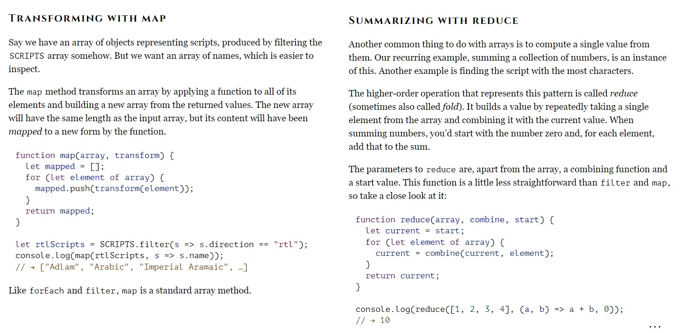

#### *Why This Topic Matters As it Relates to This Module*
We are wrapping up a few days of talking about state and props and these articles speak to solidifying understanding of the differences between the two.

### [React Docs - Thinking in React](https://reactjs.org/docs/thinking-in-react.html)
#### 1. What is the _single responsibility principle_ and how does it apply to components?
The single responsibility principle is a coding practice of building components that only do one thing. If you build it and it does more than one thing then it should be broken down into smaller parts -each that does just one thing.

#### 2. What does it mean to build a ‘static’ version of your application?
A static build does not update based on user interactivity yet still renders the UI. Because interactivity is intentionally left out and the purpose of state is to facilitate interactivity, state is discluded and data sharing is accomplished with props.

#### 3. Once you have a static application, what do you need to add?
Inverse data flow.

#### 4. What are the three questions you can ask to determine if something is state?
1. Is it passed in from a parent via props? If so, it probably isn’t state.
2. Does it remain unchanged over time? If so, it probably isn’t state.
3. Can you compute it based on any other state or props in your component? If so, it isn’t state.
Directly quoted from:  [reactjs.org](https://reactjs.org/docs/thinking-in-react.html)

#### 5. How can you identify where state needs to live?
For each piece of state in your application:

* Identify every component that renders something based on that state.
* Find a common owner component (a single component above all the components that need the state in the hierarchy).
* Either the common owner or another component higher up in the hierarchy should own the state.
* If you can’t find a component where it makes sense to own the state, create a new component solely for holding the state and add it somewhere in the hierarchy above the common owner component.
Directly quoted from:  [reactjs.org](https://reactjs.org/docs/thinking-in-react.html)

### [Higher-Order Functions](https://eloquentjavascript.net/05_higher_order.html#h_xxCc98lOBK)
#### 1. What is a “higher-order function”?
"Functions that operate on other functions, either by taking them as arguments or by returning them" -[eloquentjavascript.net](https://eloquentjavascript.net/05_higher_order.html#h_xxCc98lOBK)

#### 2. Explore the _greaterThan_ function as defined in the reading. In your own words, what is line 2 of this function doing?

I think it is returning the value of variable m when it is greater than the value of variable n.

#### 3. Explain how either _map_ or _reduce_ operates, with regards to higher-order functions.
I am not able to explain this myself YET; however, I will capture an image of part of the reading's explanation for future consideration. 

#### *Things I want to know more about*
Coding functions that create new functions.