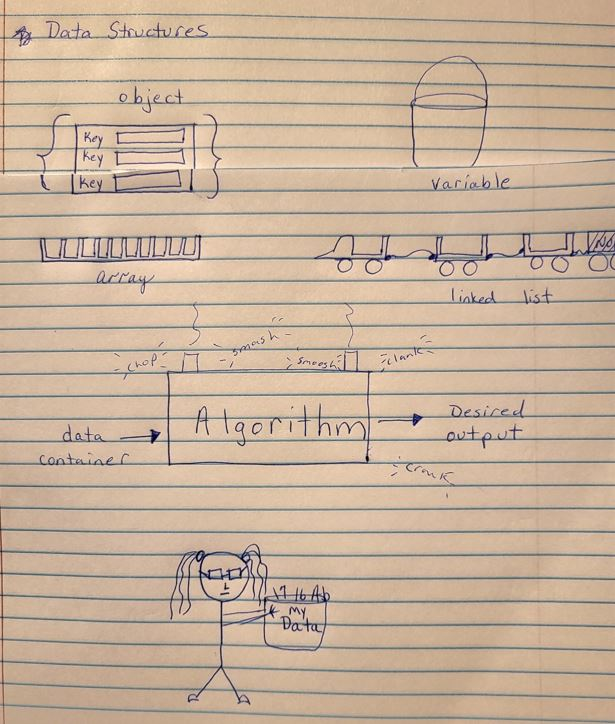

#### Linked Lists

### _Teach Something:_ 

So here's how I view data structures and algorithms:

Imagine your data as a physical thing, like a basket full of letters and numbers or whatever. You go to the container store to figure out which container is the best one to place your data in so that it can be processed. The process is going to inform your decision on containers. Once you have an appropriate container, you place your data in and run it through the algorithm to get your desired output.

A variable is just a simple bucket that can hold one datum;
An array is a rigid plastic thingie like half a muffin tin, or ice tray;
An object is like a pigeon hole letterbox; and 
a linked list is like a train with ropes connecting each car (the caboose is an inaccessible nullspace of a caboose!)

* Resource: [Big O: Analysis of Algorithm Efficiency](https://codefellows.github.io/common_curriculum/data_structures_and_algorithms/Code_401/class-05/resources/big_oh.html)

* Resource: [Linked Lists](https://codefellows.github.io/common_curriculum/data_structures_and_algorithms/Code_401/class-05/resources/singly_linked_list.html)
* Resource: [What’s a Linked List, Anyway pt1](https://medium.com/basecs/whats-a-linked-list-anyway-part-1-d8b7e6508b9d)
* Resource: [What’s a Linked List, Anyway pt2](https://medium.com/basecs/whats-a-linked-list-anyway-part-2-131d96f71996)