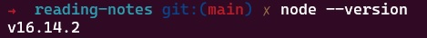
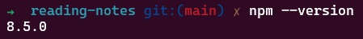

#### *Why This Topic Matters As it Relates to This Module*
Our current labs are being constructed using React which requires us to install and start npm. This reading materials helps shed light on what is going on when we issue those blackbox commands.

### [An Introduction to Node.js on sitepoint.com](https://www.sitepoint.com/an-introduction-to-node-js)
#### 1. What is node.js?
Node is a JavaScript runtime built on Chrome's V8 JavaScript Engine.

#### 2. In your own words, what is Chrome’s V8 JavaScript Engine?
An open source engine built for running JS efficiently on web browsers.

#### 3. What does it mean that node is a JavaScript runtime?
This means that it is a compiler that translates the comparatively high-level (human friendly) JavaScript programming language into a simpler, low level (computer friendly) machine language that the computer can understand and execute.

#### 4. What is npm?
npm is an acronym for "node package manager". "A package manager keeps track of what software is installed on your computer, and allows you to easily install new software, upgrade software to newer versions, or remove software that you previously installed." -From [debian.org](https://www.debian.org/doc/manuals/aptitude/pr01s02.en.html#:~:text=A%20package%20manager%20keeps%20track,software%20that%20you%20previously%20installed.)

#### 5. What version of node are you running on your machine?
I am running node version v16.14.2

#### 6. What version of npm are you running on your machine?
I am running npm version 8.5.0

#### 7. What command would you type to install a library/package called ‘jshint’?
npm install -g jshint

#### 8. What is node used for?
Node is used for installing and running dev tools. These tools automate various aspects of developing JS software solutions.

### [6 Reasons for Pair Programming](https://www.codefellows.org/blog/6-reasons-for-pair-programming/)
#### 1. What are the 6 reasons for pair programming?
Per the article:
1. Greater efficiency
2. Engaged collaboration
3. Learning from fellow students
4. Social skills
5. Job interview readiness
6. Work environment readiness

#### 2. In your experience, which of these reasons have you found most beneficial?
I found the following to be the most beneficial reasons to engage in pair programming:
* Engaged collaboration
* Learning from fellow students
* Social skills

#### 3. How does pair programming work?
_"While there are many different styles, pair programming commonly involves two roles: the Driver and the Navigator. The Driver is the programmer who is typing and the only one whose hands are on the keyboard. Handling the “mechanics” of coding, the Driver manages the text editor, switching files, version control, and—of course writing—code. The Navigator uses their words to guide the Driver but does not provide any direct input to the computer. The Navigator thinks about the big picture, what comes next, how an algorithm might be converted in to code, while scanning for typos or bugs. The Navigator might also utilize their computer as a second screen to look up solutions and documentation, but should not be writing any code."_ -From [CodeFellows.org](https://www.codefellows.org/blog/6-reasons-for-pair-programming/)

#### *Things I want to know more about*
There were three "Bookmark & Review" links for this Read assignment that looked interesting. I'm hoping to find time to go back and read through all three of them.
* [Geocoding API Docs](https://locationiq.com/)
* [Axios docs](https://www.npmjs.com/package/axios)
* [MDN async and await](https://developer.mozilla.org/en-US/docs/Learn/JavaScript/Asynchronous/Async_await)