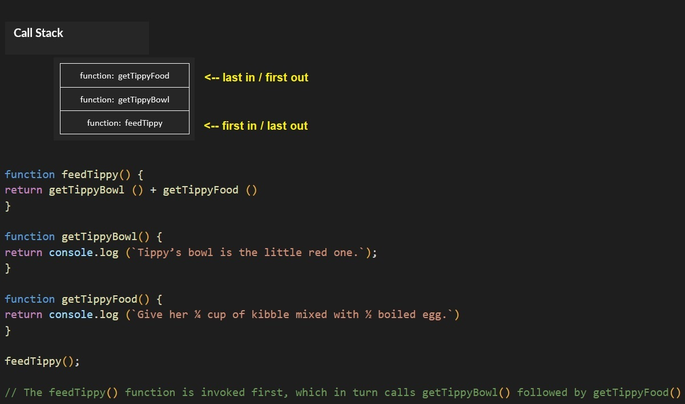

#### *Why This Topic Matters As it Relates to This Module*
It is important to understand this information so that one may more succesfully find and fix coding bugs.

### [Understanding the JavaScript Call Stack](https://medium.freecodecamp.org/understanding-the-javascript-call-stack-861e41ae61d4)
#### 1. What is a ‘call’?
A function invocation (i.e. making the function run in the code).

#### 2. How many ‘calls’ can happen at once?
Only one call can happen at once. From the reading: "Since the call stack is single, function(s) execution, is done, one at a time, from top to bottom. It means the call stack is synchronous."

#### 3. What does LIFO mean?
Last In First Out (LIFO)

#### 4. Draw an example of a call stack and the functions that would need to be invoked to generate that call stack.

#### 5. What causes a Stack Overflow?
From the reading: "A stack overflow occurs when there is a recursive function (a function that calls itself) without an exit point."

### [JavaScript error messages](https://codeburst.io/javascript-error-messages-debugging-d23f84f0ae7c)
#### 1. What is a ‘reference error’?
An error that is thrown because the variable you are referencing doesn't yet exist to the compiler; in other words, you didn't declare it before trying to use it. The error is also thrown for declaring with Let and Const if the function is hoisted into use before it has been declared.

#### 2. What is a ‘syntax error’?
Basically it's a grammar error committed against whatever language you are working in.

#### 3. What is a ‘range error’?
These errors are caused by trying to use an invalid length on an object. 

#### 4. What is a ‘type error’?
This error is thrown when the data type is not compatible with function or method in which you are trying to use or access it.

#### 5. What is a breakpoint?
A breakpoint is a pre-determined point where the code stops running to aid in debugging.

#### 6. What does the word ‘debugger’ do in your code?
Including the keyword "debugger" in your code will cause the code to pause at that point, open the debugger console, and permit you to proceed through the code line by line going forward while observing a textual history of what has/is happening. 

#### *Things I want to know more about*
[JavaScript errors reference on MDN](https://developer.mozilla.org/en-US/docs/Web/JavaScript/Reference/Errors)
Bookmarked for further reading.
