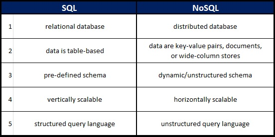

#### *Why This Topic Matters As it Relates to This Module*
We will be using databases in the upcoming lab so learning about the different database types helps make that task feasible.

#### Five differences between SQL and NoSQL databases:

### [nosql vs sql](https://www.thegeekstuff.com/2014/01/sql-vs-nosql-db/?utm_source=tuicool)
#### 1. What kind of data is a good fit for an SQL database?
"SQL databases are good fit for the complex query intensive environment"

#### 2. Give a real world example.
MySQL is a popular open-source database.

#### 3. What kind of data is a good fit a NoSQL database?
"NoSQL database are highly preferred for large data set (i.e for big data)."

#### 4. Give a real world example.
'MongoDB is one of the most popular document based NoSQL databases'

#### 5. Which type of database is best for hierarchical data storage?
"NoSQL database fits better for the hierarchical data storage as it follows the key-value pair way of storing data similar to JSON data."

#### 6. Which type of database is best for scalability?
It depends on what you're doing. "In most typical situations, SQL databases are vertically scalable. You can manage increasing load by increasing the CPU, RAM, SSD, etc, on a single server. On the other hand, NoSQL databases are horizontally scalable. You can just add few more servers easily in your NoSQL database infrastructure to handle the large traffic."

### [VIDEO: sql vs nosql ](https://www.youtube.com/watch?v=ZS_kXvOeQ5Y)
#### 1. What does SQL stand for?
Structured Query Language

#### 2. What is a relational database?
"A relational database is a collection of data items with pre-defined relationships between them. These items are organized as a set of tables with columns and rows. Tables are used to hold information about the objects to be represented in the database." -quoted from [Amazon Web Services](https://aws.amazon.com/relational-database/#:~:text=A%20relational%20database%20is%20a,be%20represented%20in%20the%20database.)

#### 3. What type of structure does a relational database work with?
A table-based, pre-defined schema.

#### 4. What is a ‘schema’?
"A database schema represents the logical configuration of all or part of a relational database." -quoted from [LucidChart](https://www.lucidchart.com/pages/database-diagram/database-schema)

#### 5. What is a NoSQL database?
A NoSQL database is a non-relational (or distributed) database comprised of "the collection of key-value pair, documents, graph databases or wide-column stores which do not have standard schema definitions which it needs to adhered to." 

#### 6. How does it work?
An SQL database works by linking collections of data by common field entries such as and ID. These links may be one to one (like number of classes a teacher teaches at an elementary school), one to many (like number of parking tickets one person may have), or many to many (like number of sales a team might have of a variety of products).

#### 7. What is inside of a Mongo database?
Rather than tables a Mongo database is comprised of a "collections" of documents (which equate a bit to the rows in a json file).  

#### 8. Which is more flexible - SQL or MongoDB? and why.
A MongoDB is going to be more flexible because there is not predetermined schema and is not subject to the limitations of relational merging.

#### 9. What is the disadvantage of a NoSQL database?
Not having predetermined schema can be a limitation if the project at hand would work best with them in place. 

#### *Things I want to know more about*
[mongoose api](https://mongoosejs.com/docs/api.html#Model)

