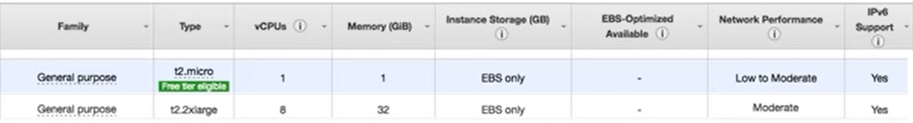

## AWS: Cloud Servers

[AWS EC2](https://aws.amazon.com/ec2/)

1. What is an EC2 Instance?

    _"An Amazon EC2 instance is a virtual server in Amazon's Elastic Compute Cloud (EC2) for running applications on the Amazon Web Services (AWS) infrastructure." [reference](https://www.google.com/search?q=What+is+an+EC2+Instance%3F&oq=what+is+&aqs=chrome.0.69i59j69i57j69i59j69i65l2j69i61l2j69i60.1657j0j7&sourceid=chrome&ie=UTF-8)_

2. Name 2 use cases for EC2.
    
    * running high performance computing (HPC) applications with more speed and (cost) efficiency
    * running cloud navit and enterprise applications

3. Provide 1 reason to use EC2 instead of a service such as Heroku, Digital Ocean, or Render.com

    EC2 is IaaS (Infrastructure as a Service) while Heroku, Digital Ocean, and Render are all PaaS. Of significance between the two types of services is the difference in what the subscriber is handling vs what is being relinquished to the service to handle. A PaaS subscriber in effect gives up total control of deployment facets and focuses soley on their applications code and data. If retaining control of the minuteau of a deployment as well as having the ability to scale very quickly one would come out better subscribing to AWS's EC2 IaaS solution. (_[reference](https://www.quora.com/Is-Amazon-EC2-IaaS-or-PaaS)_)

[EC2 For Humans](https://www.youtube.com/watch?v=lZMkgOMYYIg)
1. Where can we find EC2 on the AWS Console?

    You can find EC2 in the "Compute" section of the AWS Console. Currently, this section is located in the upper left area of the screen.

2. Explain the general difference between T2 Micro and XL.

    T-family instances feature "burst" based credit options that allow for management of CPU time. Here, during low traffic periods credits are accrued which may be applied to cover spikes of usage during "bursts" of traffic. Differences between the t2micro and t2.xl type instances are specified with regard to number of vCPUs, amount of memory allocated to the instance, and the network performance expectation. See chart snip below for specs. 

    

3. Explain a "Compute Cycle" to a non-technical friend.

    I didn't catch this in the video, but to paraphrase in layman's terms a [quora response posted by Prem Sobel](https://www.quora.com/What-is-a-Compute-cycle), a compute cycle is a sequence of four steps in which a computer processes something. With regard to AWS and cloud computing in general I would expect this to translate to a cost per unit measure of how much CPU time your instance requires.

[Elastic Beanstalk](https://www.youtube.com/watch?v=SrwxAScdyT0)
1. What is Elastic Beanstalk?
   Elastic Beanstalk is a "service that deploys, manages, and scales web apps and services". It uses "managed containers" that support a variety of environments and servers allowing developers to focus more on coding while it handles time consuming but necessary cloud computing tasks like load balancing, provisioning, scaling, and application health monitoring. It's a tool to free up the users time, kind of like a dishwasher!

2. Describe the relationship between EC2 and Elastic Beanstalk.
   Think of EC2 as a server that you've put in a basket and sent soaring out into the sky attached to helium balloons (it is powered by magic). Elastic Beanstalk would be the code name of the magical penguin that flies (yes the penguin can fly cuz magic!) over to the server now and then to push the "increase capacity" button, balance the traffic running through it and perform other general maintenance tasks when necessary. EC2 = computer; EB = caretaker.

3. Name some benefits of using Elastic Beanstalk.
    The biggest benefit to using Elastic Beanstalk is that if you'd prefer to spend your time learning code implementation you can hand off the maintenance side of things and keep on keeping on with the coding. 

    More specifically, it seems load balancing, and scaling your webserver as your work goes viral could be a grand headache that EB allows you to sidestep!

### Bookmark and Review
* [Virtual Machines](https://www.youtube.com/watch?v=yIVXjl4SwVo)

* [VMS and the Cloud](https://www.youtube.com/watch?v=l0DfHUWMjsU)

### Additional Questions
1. Looking ahead at this module's [course schedule](https://codefellows.github.io/code-401-javascript-guide/curriculum/README#module-4). What do you look forward to learning?
    How not to cause AWS-situations and time sinks.

2. What are your learning goals after reading and reviewing the [class README](https://codefellows.github.io/code-401-javascript-guide/curriculum/class-16/)?
    This subject looks like something that could be it's own full 10 month course. My goal is to NOT get lured off the path and get lost in a horrible fairyland of AWS nonsense that I don't like but can't let go of until its too late.